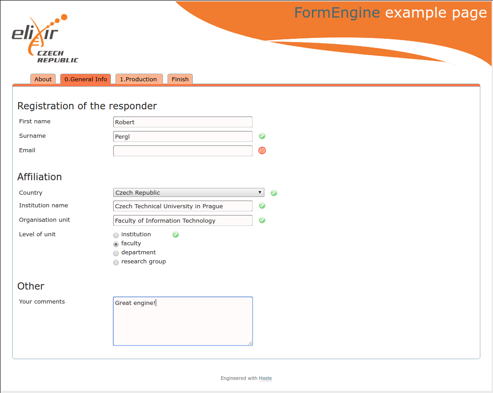

# Form Generator Example

Trivial example of form generator based on [Form Engine](https://github.com/CCMi-FIT/ds-form-engine). The generated javascript is used in a [sample static page](Page/index.html).

